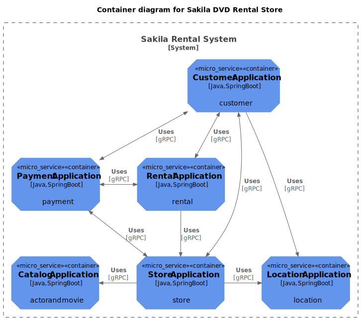
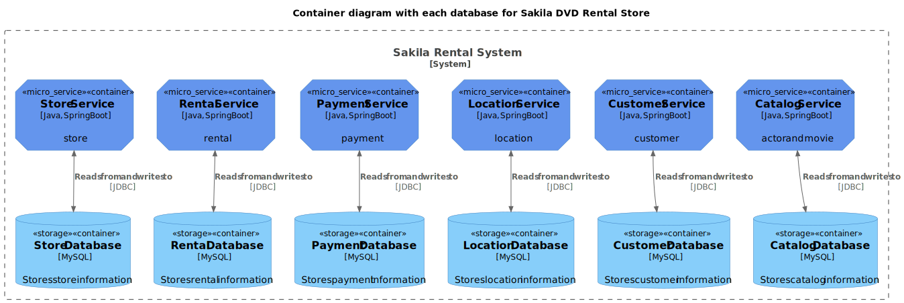
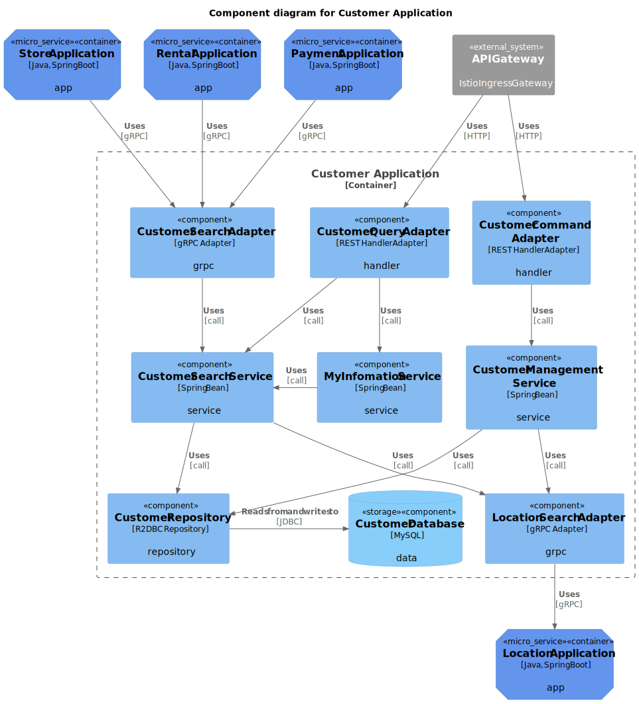
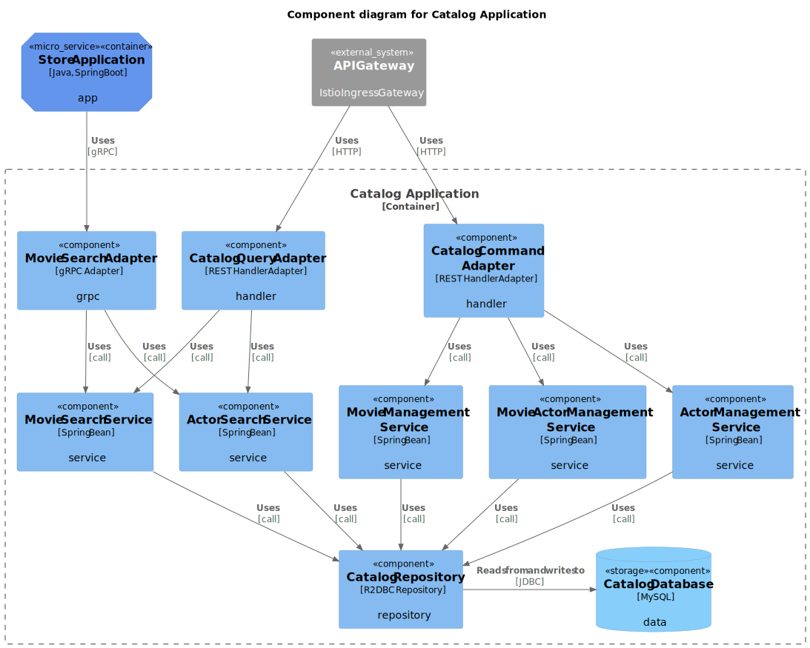
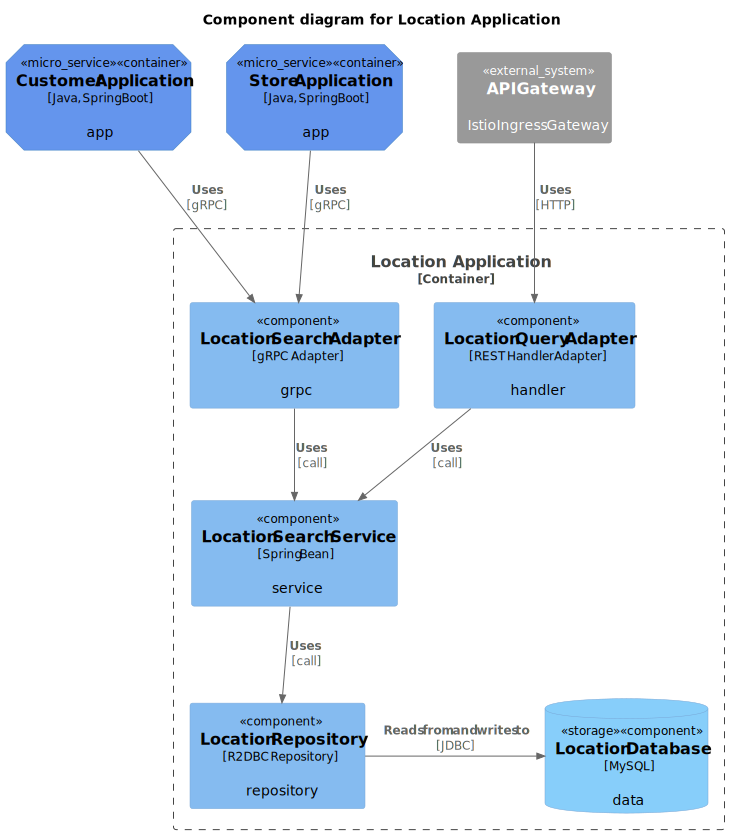

# sakila-microservices

Sakila REST API Microservices (Sample Project)

:exclamation: This project is work in progress.

This project provides rental operations for the Sakila DVD Rental Store using microservices architecture. It is implemented with hexagonal architecture(ports and adapters architecture) and reactive programming.
It's based on the Sakila sample database and serves as a example resource.

Monolith version is go to: https://github.com/codejsha/spring-rest-sakila

## Table of Contents

- [Table of Contents](#table-of-contents)
- [Getting Started](#getting-started)
  - [Requirements](#requirements)
  - [Libraries and Plugins](#libraries-and-plugins)
- [Architecture](#architecture)
  - [Services](#services)
- [Roadmap](#roadmap)
- [Sample Data](#sample-data)
- [References](#references)

## Getting Started

### Requirements

- Kotlin 1.8
- Java 17
- Gradle 8
- MySQL 8
<!-- - Apache Kafka 3 -->

### Libraries and Plugins

For a complete list, see the `gradle/libs.versions.toml` file.

- Spring WebFlux
- Spring Data R2DBC
- Google gRPC

## Architecture

The following diagram shows the architecture of the Sakila DVD Rental Store. The diagram is based on the [C4 model](https://c4model.com/).

Each service has its own database.

### Services

## Roadmap

- [ ] Implement all services
- [ ] Add gRPC, Kafka communication
- [ ] Add tests for REST Docs and OpenAPI spec
- [ ] Add Netflix Conductor for orchestration
- [ ] Add Helm charts for each service
- [ ] Add Tekton CI/CD pipeline
- [ ] Add Argo CD resources for GitOps
- [ ] Add Istio service mesh
- [ ] Add ServiceMonitor and PrometheusRule for monitoring
- [ ] Add security

## Sample Data

The sample data comes from the Sakila sample database by MySQL and is intended for learning and testing purposes. It features a relational database model for a DVD rental store company that contains data related to films, actors, customers, rentals, and more.

## References

- [MySQL Sakila sample database](https://dev.mysql.com/doc/sakila/en/)
