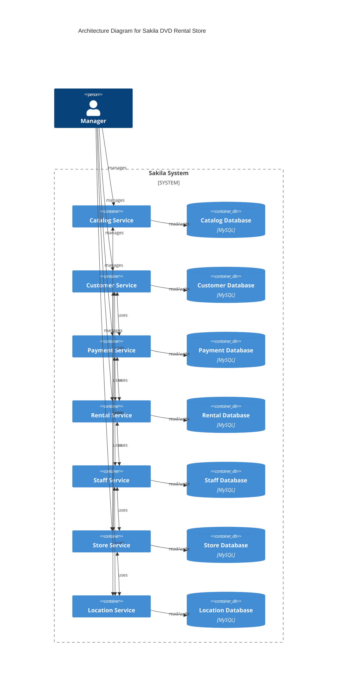

# sakila-microservices

Sakila REST API Microservices (Sample Project)

[English](README.md) | [Korean](README_ko-KR.md)

이 프로젝트는 마이크로 서비스 아키텍처를 사용하여 Sakila DVD 렌탈 스토어에 대한 대여 서비스를 제공합니다. Sakila 데이터베이스를 기반으로 하며 학습 리소스 목적으로 작성되었습니다.

모놀리스 버전은 다음 링크를 참조하세요: https://github.com/codejsha/spring-rest-sakila

## 목차

- [목차](#목차)
- [시작하기](#시작하기)
  - [요구사항](#요구사항)
  - [라이브러리 및 플러그인](#라이브러리-및-플러그인)
- [아키텍처](#아키텍처)
- [예정사항 (로드맵)](#예정사항-로드맵)
- [샘플 데이터](#샘플-데이터)
- [참조](#참조)

## 시작하기

### 요구사항

- Kotlin 1.8
- Java 17
- Gradle 8
- MySQL 8
- Apache Kafka 3
- MongoDB 6

### 라이브러리 및 플러그인

전체 목록은 `gradle/libs.versions.toml` 파일을 참조하세요.

- Spring WebFlux
- Spring Data R2DBC
- Axon Framework
- MapStruct

## 아키텍처

이 다이어그램은 Sakila DVD 렌탈 스토어의 아키텍처를 보여줍니다. 다이어그램은 [C4 모델](https://c4model.com/)을 기반으로 합니다.

## 예정사항 (로드맵)

- [ ] Implement all services
- [ ] Add tests for REST Docs and OpenAPI spec
- [ ] Add HATEOAS
- [ ] Add Netflix Conductor for orchestration
- [ ] Add Helm charts for each service
- [ ] Add Tekton CI/CD pipeline
- [ ] Add Argo CD resources for GitOps
- [ ] Add Istio service mesh
- [ ] Add ServiceMonitor and PrometheusRule for monitoring
- [ ] Add security

## 샘플 데이터

샘플 데이터는 MySQL의 Sakila 샘플 데이터베이스에서 제공되며 학습 및 테스트 목적으로 사용됩니다. 영화, 배우, 고객, 대여 등과 관련된 데이터를 포함하는 DVD 렌탈 스토어 회사의 관계형 데이터베이스 모델을 제공합니다.

## 참조

- [MySQL Sakila sample database](https://dev.mysql.com/doc/sakila/en/)
